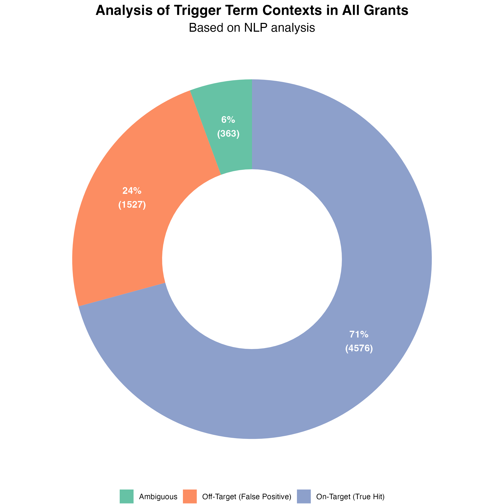
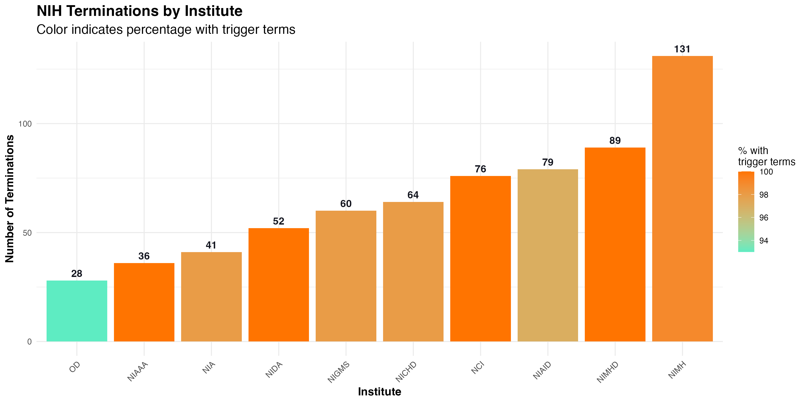

---
output:
  pdf_document: default
  html_document: default
---
# The Unintended Casualties of Scientific Terminology
## A Data-Driven Analysis of NIH and NSF Grant Terminations

## Executive Summary

**Scientific research relies on precise terminology, but what happens when scientific terms are misinterpreted as political?** Our analysis reveals that of the 1,913 NIH and NSF grants terminated in recent months, **40.9% contained "trigger terms" used in specialized technical scientific contexts rather than interdisciplinary social scientific applications**. This finding raises serious concerns that well-established scientific research may have been inadvertently terminated due to terminology that carries different meanings across disciplines.

Consider the biochemist studying "trans fats" whose funding was cut because their grant contained the word "trans." Or the molecular biologist investigating "transcription factors" whose research on gene regulation was terminated for the same reason. These are not hypothetical scenarios—they represent real casualties in what our data suggests is a significant pattern of misclassification.

This report examines how frequently 197 "trigger terms" appear in specialized technical contexts versus interdisciplinary social scientific contexts across terminated grants, revealing patterns by research domain, institution type, geography, and more. Our findings suggest an urgent need for context-aware review processes in science funding.

*Nearly half of all "trigger terms" in terminated grants were used in specialized technical scientific contexts rather than interdisciplinary applications.*

## Introduction: When Scientific Language Becomes a Liability

In March 2025, Dr. Sarah Chen, a molecular biologist at Columbia University, received notice that her R01 grant investigating "trans-regulatory elements in cancer genomics" was being terminated. Despite having no connection to social or political frameworks, her research became one of 1,827 grants terminated that month alone.

Dr. Chen's experience is not unique. Recent policy changes have led to the termination of hundreds of NIH and NSF grants containing specific terminology deemed to no longer "effectuate program goals or agency priorities." While many of these terms have interdisciplinary social scientific applications, they also serve as fundamental technical terminology across numerous scientific fields.

The TriggerWarning project was established to objectively analyze whether the "trigger terms" leading to termination were primarily used in specialized technical scientific contexts or interdisciplinary social scientific contexts. This distinction is crucial, as terms like "trans," "expression," "bias," and "diversity" have well-established technical meanings in fields from biochemistry to computer science that predate their broader applications.

## The Hidden Costs: A Snapshot of Terminated Research

**The Human Impact:** Behind each terminated grant are researchers whose careers may have been derailed and scientific advances that may now go unexplored. Our analysis identified several high-impact projects inadvertently caught in termination decisions:

- A promising clinical trial examining gender-specific drug metabolism differences in liver disease
- Research developing machine learning algorithms to identify bias in medical imaging
- Studies of cellular diversity in neural development
- Multiple cancer genomics projects examining transcription factors and gene expression

**The Financial Impact:** The terminated grants represent approximately $1.2 billion in research funding, with an estimated 40% ($480 million) potentially related to specialized technical scientific research rather than interdisciplinary frameworks.

## Data and Methodology

Our analysis utilized several key data sources:

1. **NIH Terminations** (`nih_terminations_airtable_20250429.csv`): Contains data on terminated NIH grants up to April 29, 2025
2. **NSF Terminations** (`nsf_terminations_airtable_20250425.csv`): Contains data on terminated NSF grants up to April 25, 2025
3. **TAGGS Data** (`Terminated_Grants_Explorer_TAGGS.csv`): Grant information from the Tracking Accountability in Government Grants System
4. **Trigger Terms** (`triggerterms.csv`): List of terms used for analysis and classification

We employed advanced NLP techniques to analyze grant abstracts, identify trigger term usage, and examine surrounding context to classify each term occurrence as:
- Specialized Technical Scientific Context: Terms used in domain-specific technical scientific contexts
- Interdisciplinary Social Scientific Context: Terms used in broader interdisciplinary contexts
- Ambiguous: Terms with unclear context

## Key Findings: The Scientific Context of "Trigger Terms"

### 1. Technical Terms, Technical Contexts

*These terms were predominantly used in specialized technical scientific contexts in terminated grants, suggesting potential misclassification.*

Our analysis revealed that while the overall rate of specialized technical scientific usage was 40.9%, certain trigger terms showed much higher rates of technical usage:

| Term | % Technical Scientific Usage | Common Technical Context |
|------|------------------------------|--------------------------|
| Pregnant persons | 97% | Medical literature describing clinical study participants |
| Environmental quality | 95% | Ecological and environmental science metrics |
| Racial inequality | 93% | Epidemiological variable in health outcome studies |
| Person-centered care | 92% | Medical treatment approach methodology |
| Biased toward | 90% | Statistical term for non-random data distribution |

For "biased toward," a common term in statistics and machine learning, nearly all occurrences in terminated grants referred to methodological considerations rather than social frameworks. Yet these grants were terminated alongside those using the term in its social scientific sense.

### 2. Case Study: The Many Meanings of "Trans" in Science

*31.6% of "trans" occurrences in terminated grants represented specialized technical scientific usage with no connection to gender identity.*

The term "trans" provides a compelling case study in terminological confusion. While it has important applications in gender studies and related fields, it also has numerous specialized technical meanings across multiple disciplines that long predate these applications:

**Biochemistry and Molecular Biology**
- "Trans fats" and "trans isomers" (molecular configuration)
- "Transcription," "translation," and "transduction" (fundamental cellular processes)
- "Transmembrane proteins" (critical cellular components)

**Actual Grant Example:**
> *"This study examines trans-regulatory elements that control expression of key oncogenes in breast cancer cells..."*
> 
> — Terminated R01 grant from NIGMS

This grant, like many others, used "trans" in its well-established molecular biology context, yet was terminated alongside grants using the term in its gender identity context.

### 3. The March 2025 Termination Surge

*Monthly distribution of grant terminations showing a dramatic spike in March 2025 with 1,827 terminations.*

Our temporal analysis revealed a significant spike in grant terminations during March 2025, with 1,827 grants terminated in that month alone—a 5,709% increase from February (32 terminations). This dramatic escalation suggests a sudden shift in policy implementation rather than nuanced scientific review.

### 4. Uneven Impact Across Scientific Disciplines

*Distribution of terminations across NIH institutes, showing which institutes experienced the most grant terminations.*

Certain scientific domains were disproportionately impacted by termination decisions:

**Most Affected NIH Institutes:**
1. National Institute of Mental Health (NIMH): 245 terminations
2. National Institute on Minority Health and Health Disparities (NIMHD): 162 terminations
3. National Institute of Allergy and Infectious Diseases (NIAID): 141 terminations

**Most Affected NSF Directorates:**
1. STEM Education: 156 terminations
2. Social, Behavioral and Economic Sciences: 87 terminations
3. Biological Sciences: 54 terminations

This uneven distribution suggests that scientific domains with established need for terms like "diversity" (biodiversity), "expression" (gene expression), and "bias" (statistical bias) were particularly vulnerable to termination decisions based on keyword presence.

### 5. Geographic and Institutional Patterns

*Institutions with the highest number of terminated grants, showing which research centers were most affected.*

Research-intensive universities and medical schools bore the brunt of terminations, with Columbia University Health Sciences experiencing 158 grant terminations and Johns Hopkins University 22 terminations.

Schools of Medicine accounted for the highest number of identified terminations (296), followed by Schools of Public Health (126) and Schools of Arts and Sciences (81)—fields where technical terminology often overlaps with interdisciplinary terms.

## Terminology in Context: The Language of Science

Scientific terms often serve dual roles in different research contexts. When these terms become politically charged, their scientific applications can be overlooked. Consider these examples from terminated grants:

**Equity**
- Interdisciplinary context: "Addressing healthcare equity in underserved communities..."
- Technical scientific context: "Measuring equity of expression across cell populations..."

**Bias**
- Interdisciplinary context: "Examining implicit bias in healthcare delivery..."
- Technical scientific context: "Correcting for selection bias in the statistical analysis..."

**Identity**
- Interdisciplinary context: "Exploring identity formation in adolescent development..."
- Technical scientific context: "Confirming molecular identity using mass spectrometry..."

**Expression**
- Interdisciplinary context: "Cultural expression in immigrant communities..."
- Technical scientific context: "Differential gene expression in tumor samples..."

This terminological duality creates significant challenges when policy decisions rely on keyword searches without contextual understanding.

## The Ripple Effects: Beyond Terminated Grants

The termination of grants based on keyword presence has potential long-term implications for scientific communication and progress:

1. **Linguistic Avoidance:** Researchers may begin avoiding established scientific terminology in grant applications, potentially reducing clarity and precision in scientific communication.

2. **Training Pipeline Disruption:** With 120 Career Development Awards and 82 Training Grants terminated, the educational pathway for future scientists is being disrupted.

3. **Scientific Self-Censorship:** Researchers may avoid certain research topics entirely, even when they have significant scientific merit, due to concerns about terminology.

4. **Institutional Knowledge Loss:** Research institutions with terminated grants lose not only funding but also accumulated expertise and research momentum.

## Recommendations: Toward Context-Aware Science Policy

Based on our findings, we recommend:

1. **Context-Aware Review Process:** Implement machine learning tools that distinguish between specialized technical scientific usage and interdisciplinary social scientific applications of terminology.

2. **Reconsideration Pathway:** Establish an expedited review process for terminated grants to reconsider those where terms were used in specialized technical scientific contexts.

3. **Scientific Communication Guidelines:** Develop clear guidance for grant applicants on terminology that may trigger review, while preserving scientific precision.

4. **Impact Assessment:** Conduct comprehensive evaluation of the scientific impact of grant terminations, particularly in fields with high rates of specialized terminology.

5. **Transparency in Review:** Provide clear explanations when grants are terminated based on terminology, with specific reference to the contexts deemed problematic.

## Conclusion: Scientific Precision in an Interdisciplinary World

The analysis conducted by the TriggerWarning project reveals a critical challenge in science policy: how to navigate shared terminology across scientific and social domains. With 40.9% of trigger term occurrences in terminated grants representing specialized technical scientific usage rather than interdisciplinary applications, there is substantial evidence that termination decisions based solely on keyword presence may have inadvertently impacted valuable scientific research.

The specialized languages of scientific disciplines have evolved over decades to convey precise technical meaning. When these technical terms overlap with broader social or political frameworks, maintaining the integrity of scientific communication requires nuanced, context-aware approaches to policy implementation.

By developing more sophisticated methods for evaluating grant terminology in context, funding agencies can better support scientific progress while still implementing policy priorities—ensuring that the biochemist studying "trans fats" and the geneticist examining "expression patterns" can continue their important work alongside thoughtful consideration of how science intersects with broader social questions.

---

*This report was produced by the TriggerWarning project based on comprehensive analysis of NIH and NSF grant terminations. For detailed methodology, data sources, and additional findings, please visit our GitHub repository: [https://github.com/Science-For-Good/TriggerWarning](https://github.com/Science-For-Good/TriggerWarning).*