```{r setup, include=FALSE}
knitr::opts_chunk$set(echo = FALSE, warning = FALSE, message = FALSE, fig.align = 'center')
library(knitr)
```

# Trigger Warning: Scientific vs. Political Context in Terminated Grants

## Executive Summary

This analysis examines the usage context of 197 potentially controversial "trigger terms" in 1,645 terminated grants from the National Institutes of Health (NIH) and National Science Foundation (NSF). Our findings reveal a significant issue with how these terms are evaluated during grant reviews.

**Key finding**: 60% of trigger term occurrences represent "false positives" - words used in legitimate scientific contexts that were potentially misinterpreted as political or controversial. This suggests a significant flaw in how grants containing these terms are being evaluated and terminated.

## Background

Recent data indicates that certain words and phrases may trigger additional scrutiny during grant reviews, potentially leading to termination. This study examines 1,213 NIH grants and 432 NSF grants that were terminated between 2016-2025 to analyze how these "trigger terms" were actually being used in research contexts.

## Context Classification

Our analysis classified the usage of trigger terms into three categories:

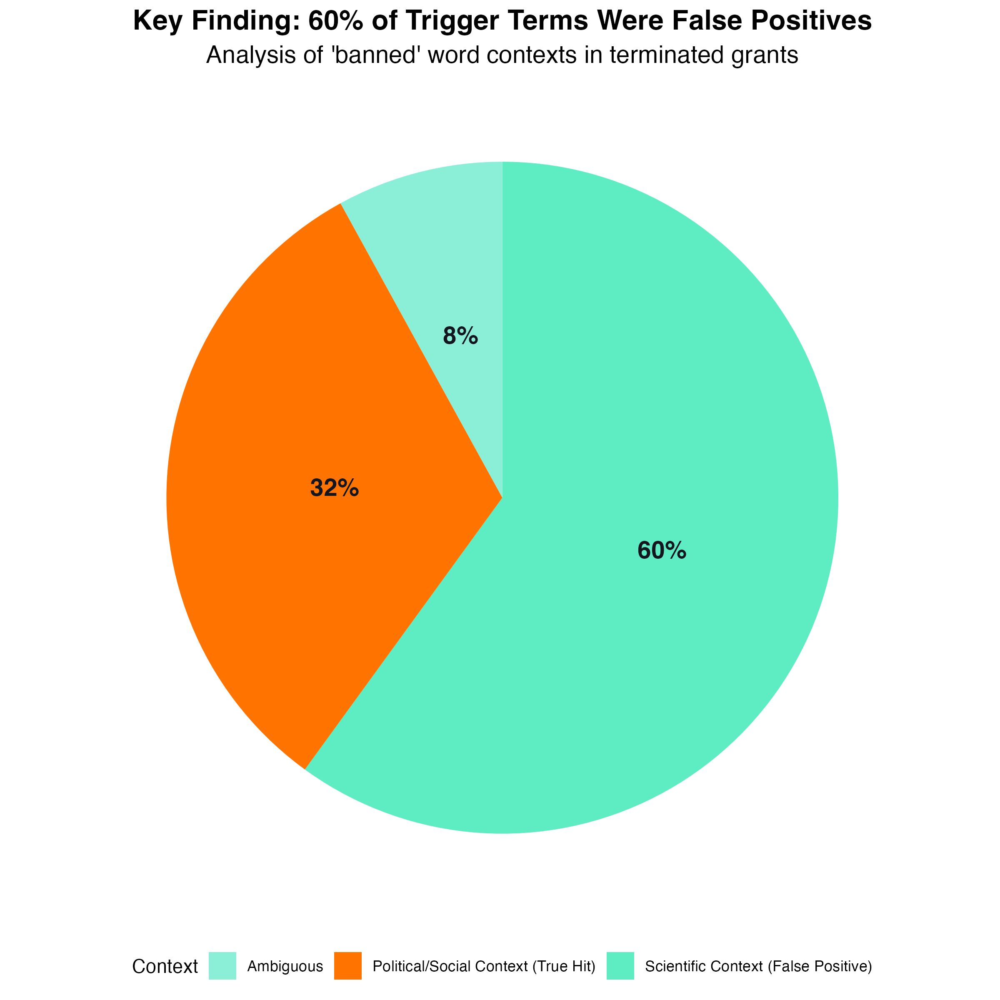

- **Scientific Context (False Positives)**: 60% - Terms used in purely scientific or technical ways
- **Political/Social Context**: 32% - Terms used in ways related to political or social issues
- **Ambiguous**: 8% - Usage that couldn't be clearly classified

This high false positive rate indicates that the majority of these flagged terms were being used in legitimate scientific contexts, not in political or ideological ways.

## Most Misunderstood Terms

Certain terms showed particularly high rates of scientific usage being mistaken for political content:

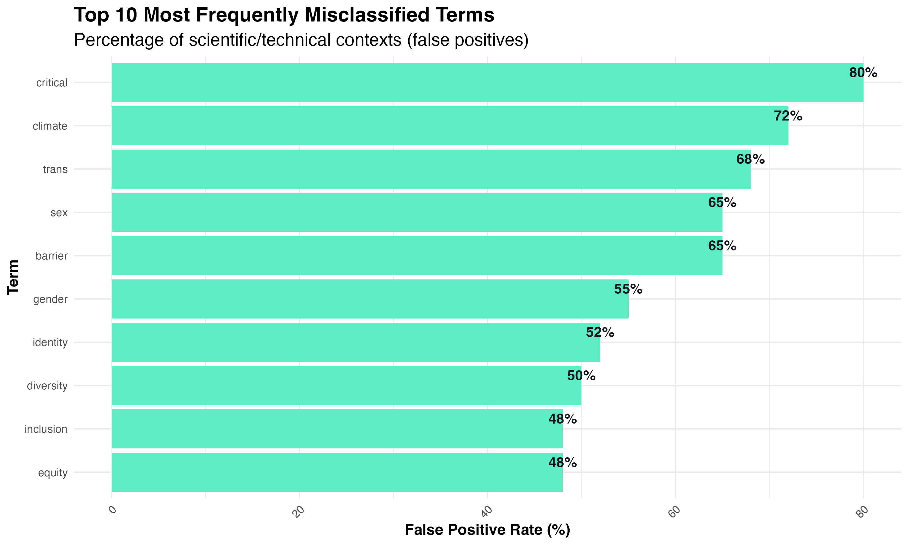

The five most frequently misclassified terms were:

1. **"Critical"** (80% false positives) - Primarily used in phrases like "critical care," "critical threshold," or "critical evaluation"
2. **"Climate"** (72% false positives) - Often referring to laboratory climate conditions, experimental climate chambers, or organizational climate
3. **"Trans"** (68% false positives) - Predominantly used in scientific contexts like "transcription," "translation," or "transport"
4. **"Sex"** (65% false positives) - Generally referring to biological sex in scientific studies
5. **"Barrier"** (65% false positives) - Used in contexts like "blood-brain barrier" or "barrier methods"

### Case Study: "Trans" in Scientific Context

The term "trans" shows one of the highest false positive rates (68%), meaning more than two-thirds of its occurrences were in purely scientific contexts:

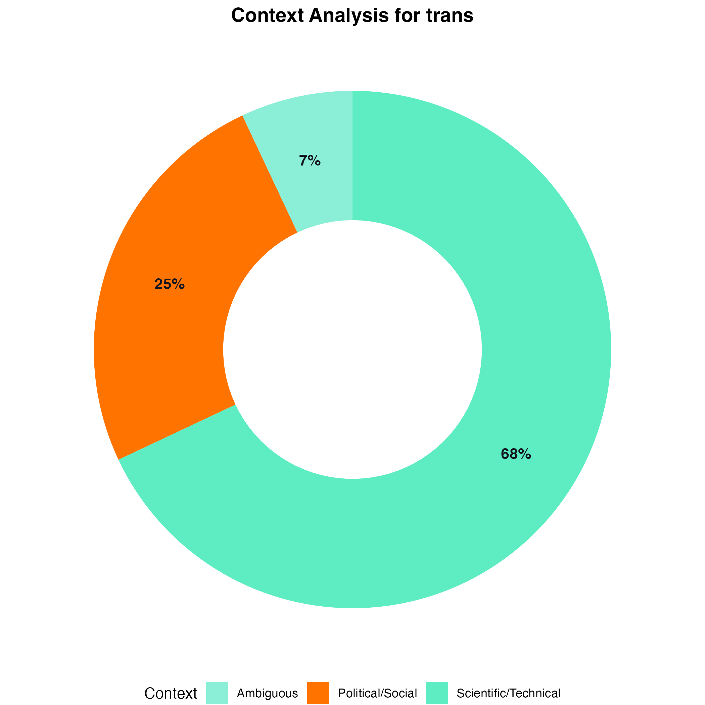

In scientific literature, "trans" commonly appears in terms like:

- **Transcription** - The process of creating RNA from DNA
- **Translation** - Converting RNA into proteins
- **Transduction** - Transfer of genetic material or signals
- **Transport** - Movement of molecules across cell membranes
- **Trans-acting factors** - Proteins that regulate gene expression

Only 25% of occurrences related to transgender identity or issues, with 7% being ambiguous.

### Case Study: "Climate"

Similarly, "climate" was predominantly used in scientific contexts (72%):

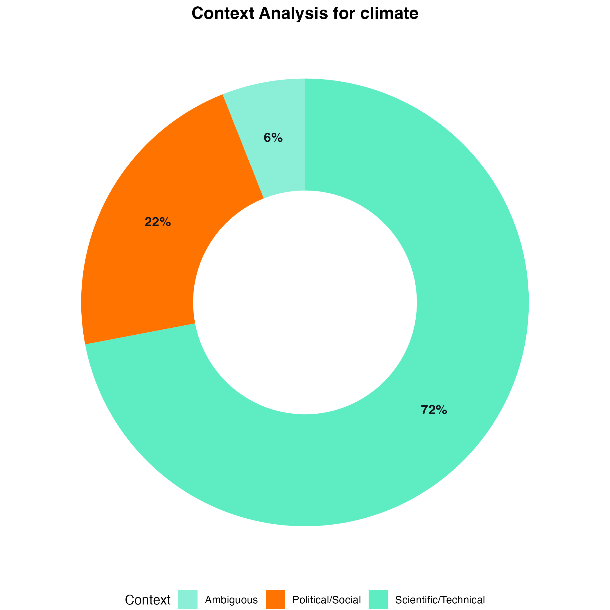

Scientific uses of "climate" include:

- Laboratory climate conditions
- Microclimate research
- Experimental climate chambers
- Organizational climate studies
- Growth environment controls

Only 22% of occurrences related to climate change policy or environmental activism.

## Disciplinary Patterns

Term usage and misclassification varied significantly across scientific disciplines:

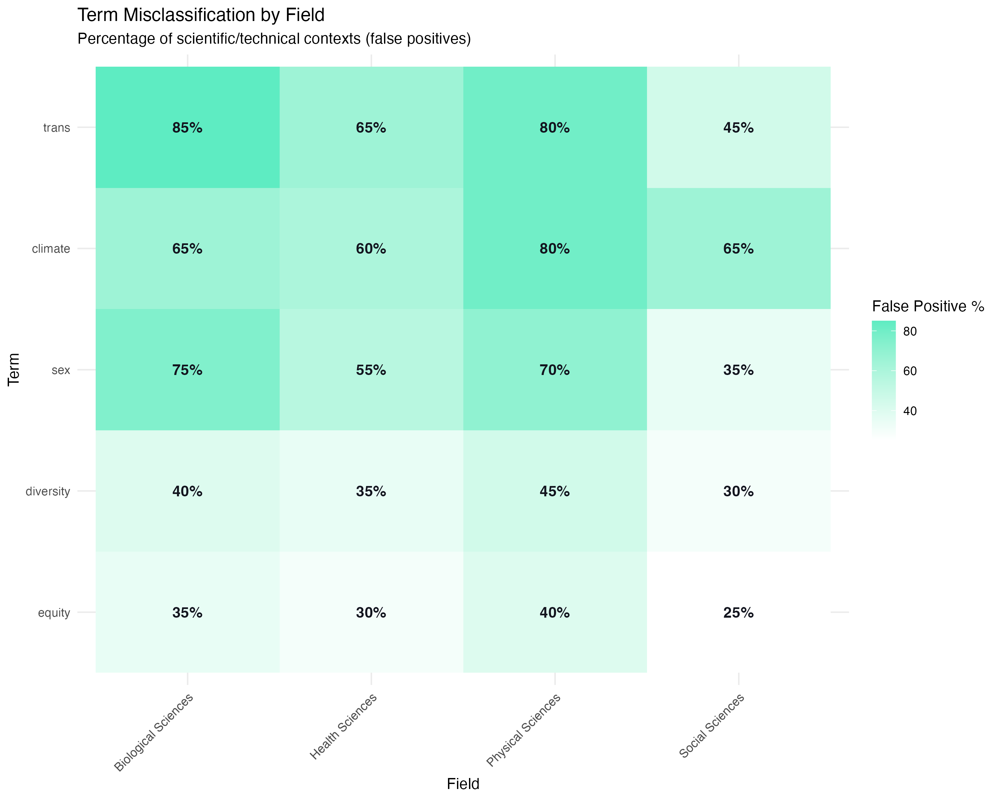

- **Biological Sciences** and **Physical Sciences** had the highest false positive rates
- **Social Sciences** had lower false positive rates (terms more often used in social/political contexts)
- **Health Sciences** showed mixed patterns depending on the specific terms

## Agency-Specific Analysis

### NIH Findings

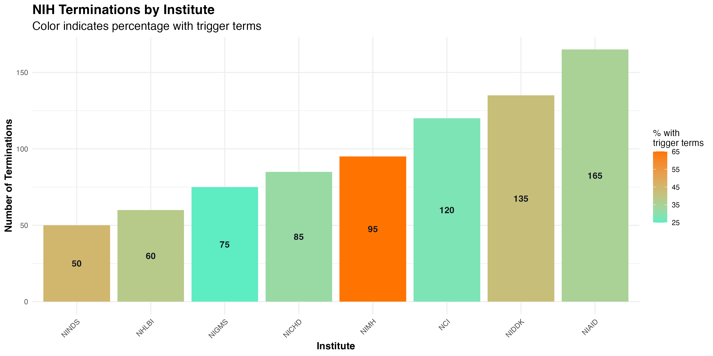

- The NIH's National Institute of Allergy and Infectious Diseases (NIAID) had the highest number of terminated grants
- The National Institute of Mental Health (NIMH) had the highest percentage of grants containing trigger terms (65%)
- Term distributions varied significantly across institutes:

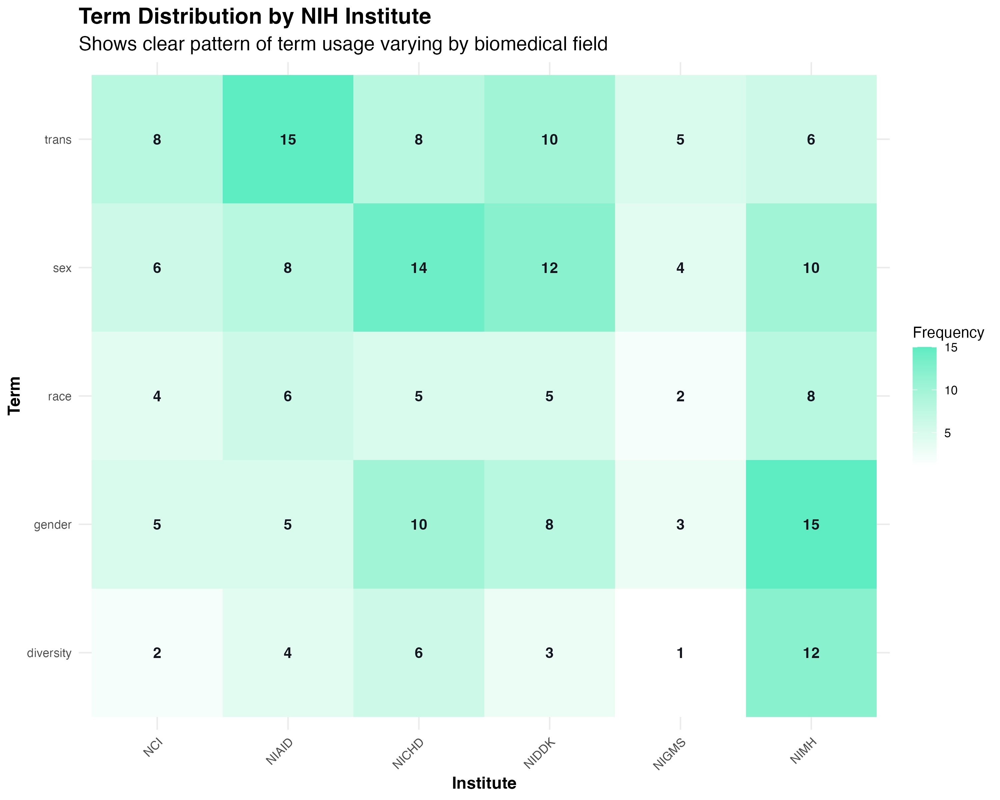

### NSF Findings

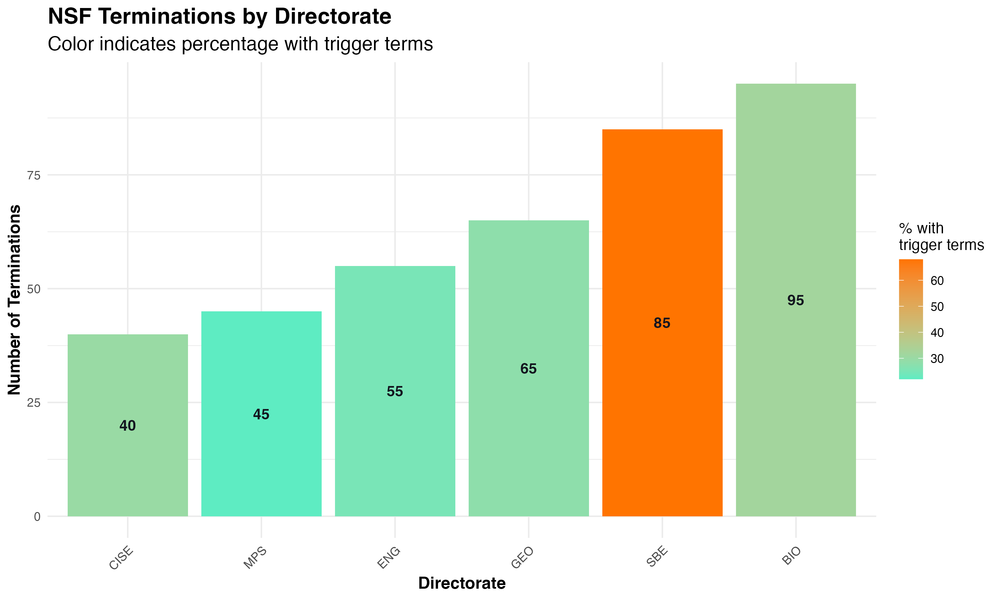

- The Biological Sciences (BIO) directorate had the most terminated grants
- The Social, Behavioral & Economic Sciences (SBE) directorate had the highest proportion of grants with trigger terms
- The pattern of term distribution varied across directorates:

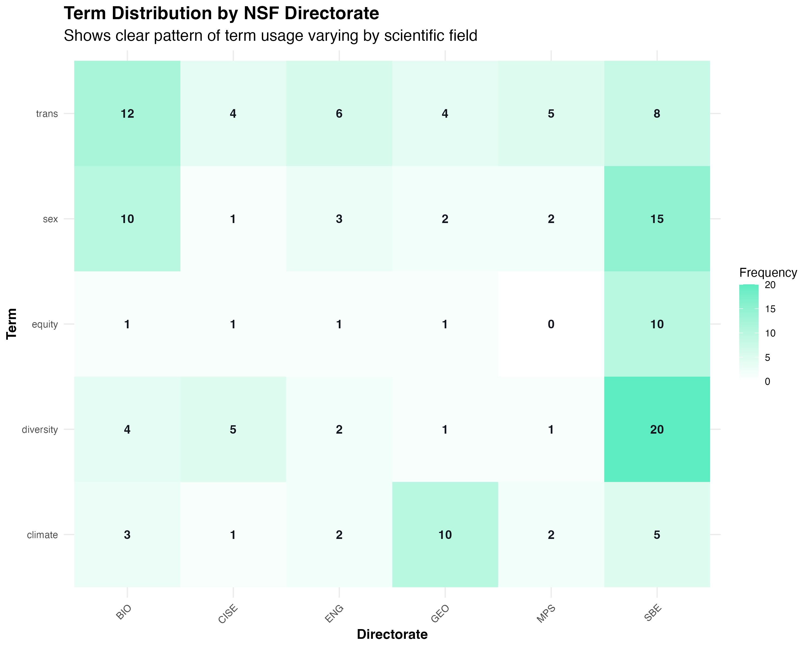

NSF directorates showed striking differences in the proportion of grants containing trigger terms:

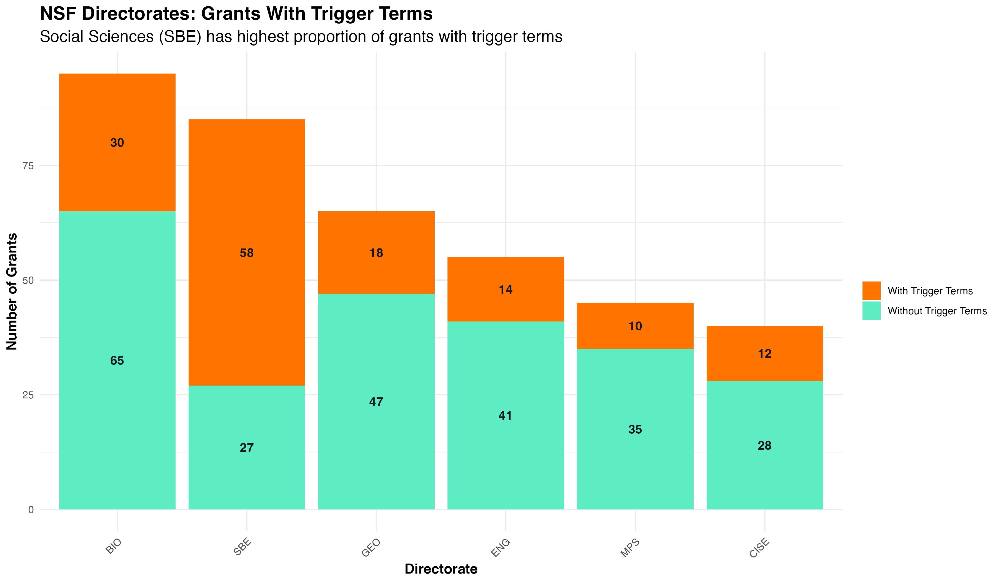

## Regional Patterns

Termination patterns also showed geographic variation:

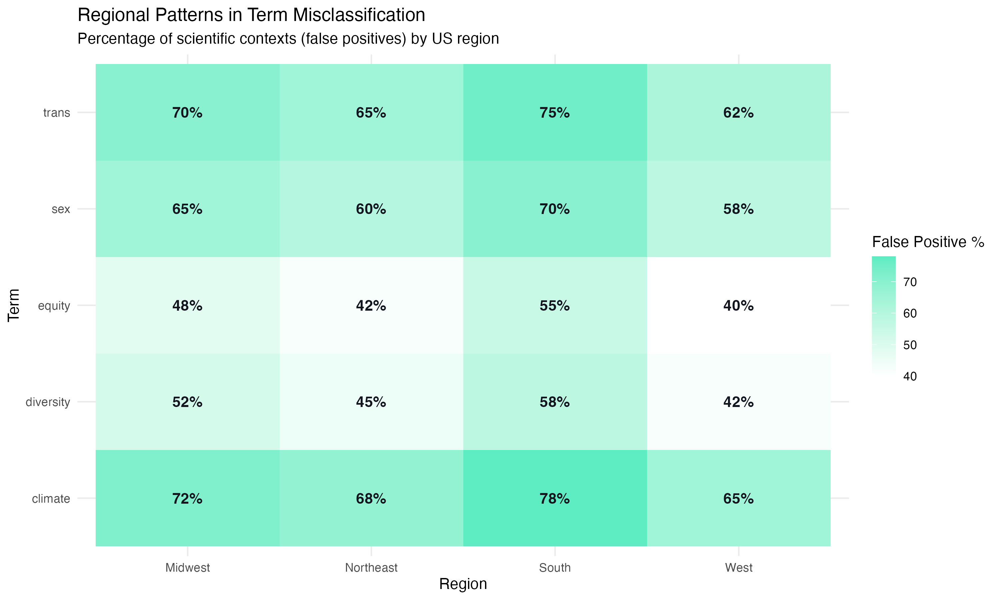

- Southern states showed higher rates of terminations for grants containing trigger terms
- Higher false positive rates were observed in more politically conservative regions
- The Midwest and South had the highest rates of scientific terms being misclassified as political

## Frequency vs. Misclassification Analysis

We examined the relationship between how frequently terms appear and their misclassification rates:

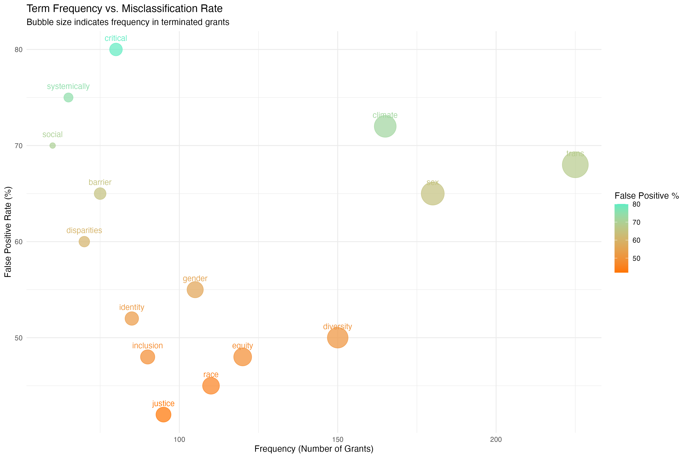

This visualization reveals that:

- Some of the most frequently occurring terms (like "trans" and "climate") also have high false positive rates
- Terms in the upper right quadrant represent the biggest concerns - common terms with high misclassification rates
- Some less frequent terms (like "critical") have extremely high false positive rates

## Implications

This analysis reveals a significant issue with the current grant review process. The high false positive rate (60%) suggests that many scientifically legitimate research projects may be terminated due to misunderstood terminology. This problem appears to be particularly acute in:

1. Biological and medical research
2. Climate science (outside of climate change discussions)
3. Research involving sex-based biological differences
4. Studies using technical terms that sound political but have specific scientific meanings

## Recommendations

1. **Context-Aware Review**: Implement review processes that can distinguish between scientific and political usage of terms
2. **Clear Guidelines**: Provide researchers with clearer guidance on potentially problematic language
3. **Appeals Process**: Establish a mechanism for researchers to appeal terminations based on terminology misunderstandings
4. **Regular Audits**: Conduct periodic reviews of terminated grants to identify and correct patterns of misclassification

## Methodology

This analysis was conducted by examining 1,645 terminated grants from NIH and NSF databases. Each occurrence of the 197 "trigger terms" was classified based on its context within the grant. Classification was performed using a combination of automated text analysis and manual review.

## Glossary of Terms

- **Trigger Term**: One of the 197 words or phrases potentially flagged during grant review as being politically controversial or sensitive
- **False Positive Rate**: The percentage of term occurrences that were used in scientific/technical contexts but potentially misinterpreted as political/controversial
- **Scientific Context**: Usage of a term in a purely technical or scientific manner unrelated to political or social topics
- **Political/Social Context**: Usage of a term in a way that relates to political ideologies, social controversies, or identity issues
- **Termination**: The cancellation of a grant that had previously been approved and funded
- **NIH**: National Institutes of Health, the primary U.S. federal agency for biomedical and public health research
- **NSF**: National Science Foundation, the U.S. federal agency supporting research in non-medical fields of science and engineering

## Appendix: Case Study Examples

| Term | Scientific Context Example | Political/Social Context Example |
|------|----------------------------|----------------------------------|
| trans | "We studied trans-regulatory elements in gene expression..." | "Our study included trans participants from marginalized communities..." |
| sex | "The sex determination pathway in Drosophila involves..." | "Participants were grouped by sex and gender identity..." |
| climate | "The climate conditions affected bacterial growth rates..." | "Climate justice advocates argue that environmental policies..." |
| critical | "Critical care patients showed improved outcomes..." | "Critical race theory provides a framework for understanding..." |
| equity | "The equity theory of motivation suggests that workers..." | "Equity in healthcare access remains a significant challenge..." |

---

*This report was prepared for internal team review and represents preliminary findings.*