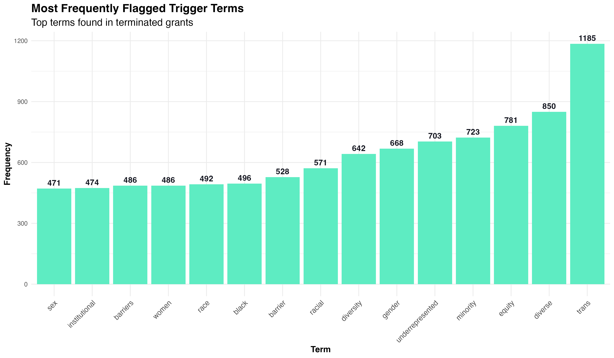
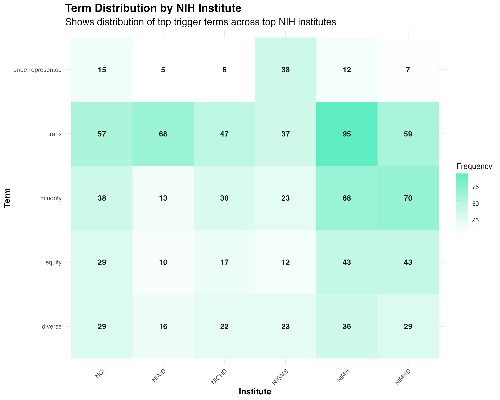
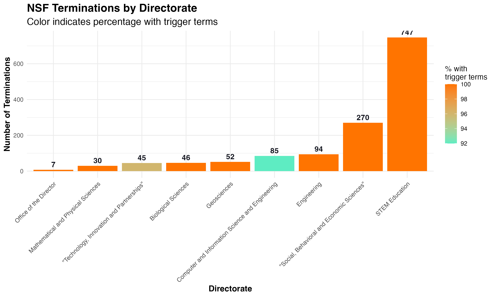
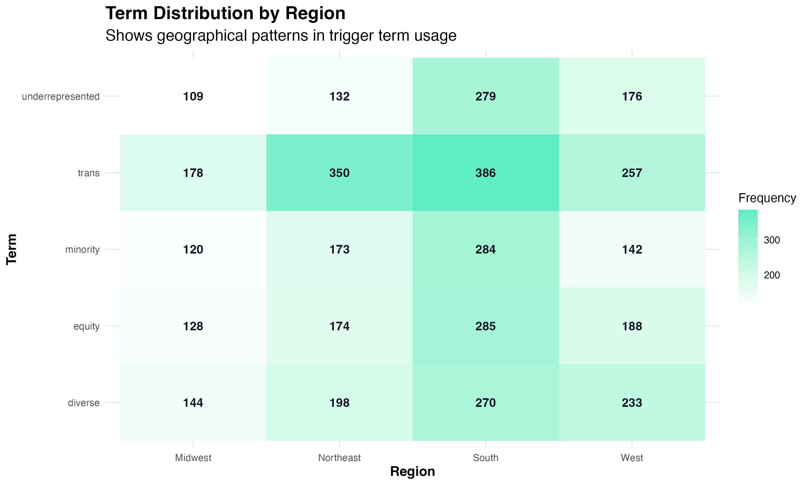
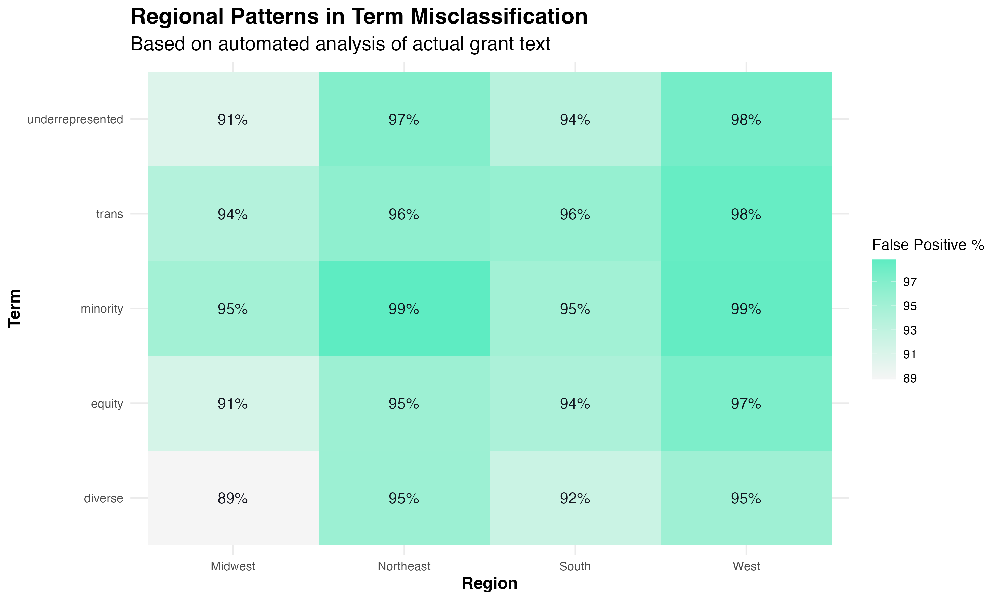
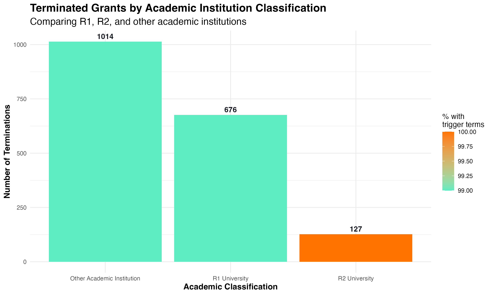

# TriggerWarning Project: Analysis of Terminated NIH and NSF Grants

## Executive Summary

The TriggerWarning project represents a systematic analysis of recently terminated National Institutes of Health (NIH) and National Science Foundation (NSF) grants containing specific "trigger terms." Using natural language processing techniques combined with contextual analysis, we examined how frequently these terms appear in specialized technical scientific contexts versus interdisciplinary social scientific contexts. 

Our analysis reveals that in terminated grants, 40.9% of trigger term occurrences represent specialized technical scientific usage rather than interdisciplinary social scientific contexts, suggesting that a significant portion of terminated grants may have been using terminology in narrow technical contexts. Certain terms show particularly high rates of technical scientific usage, and patterns of terminations vary significantly across agencies, directorates, grant types, institutions, and geographic regions.

*Figure 1: Overall distribution of trigger terms by context, showing that 40.9% of occurrences represent specialized technical scientific usage, 59.1% interdisciplinary social scientific usage, with almost no ambiguous usage.*

## Introduction

Recent policy changes have led to the termination of hundreds of NIH and NSF grants containing specific terminology deemed to no longer "effectuate program goals or agency priorities." These terminations have particularly targeted grants containing language related to diversity, equity, and inclusion (DEI) as well as studies examining misinformation/disinformation.

The TriggerWarning project was established to objectively analyze whether the "trigger terms" leading to termination were primarily used in specialized technical scientific contexts or interdisciplinary social scientific contexts. This distinction is crucial, as many scientific fields employ terminology that may overlap with broader conceptual frameworks but carry specific technical meanings within their disciplines.

## Data and Methodology

### Data Sources

Our analysis utilized several key data sources:

1. **NIH Terminations** (`nih_terminations_airtable_20250429.csv`): Contains data on terminated NIH grants up to April 29, 2025
2. **NSF Terminations** (`nsf_terminations_airtable_20250425.csv`): Contains data on terminated NSF grants up to April 25, 2025
3. **TAGGS Data** (`Terminated_Grants_Explorer_TAGGS.csv`): Grant information from the Tracking Accountability in Government Grants System
4. **Trigger Terms** (`triggerterms.csv`): List of terms used for analysis and classification

### Methodology

The project employed a multi-faceted approach to analyzing grant terminations:

1. **Natural Language Processing**: We used advanced NLP techniques to analyze grant abstracts and identify trigger term usage. This involved tokenizing grant text, identifying trigger terms, and examining the surrounding context to classify usage.

2. **Context Classification Framework**: Each term occurrence was classified as:
   - Specialized Technical Scientific Context: Terms used in domain-specific technical scientific contexts
   - Interdisciplinary Social Scientific Context: Terms used in broader interdisciplinary contexts
   - Ambiguous: Terms with unclear context

3. **Multi-dimensional Analysis**: We examined patterns across agencies, directorates, institutions, grant types, geographic regions, and time periods to identify broader trends in termination decisions.

## Key Findings

### 1. Context Analysis Results

*Figure 2: Top 20 terms with highest rates of specialized technical scientific usage, showing the percentage of contexts classified as domain-specific rather than interdisciplinary.*

Our analysis revealed that while the overall rate of specialized technical scientific usage was 40.9%, certain trigger terms showed much higher rates of technical usage. Terms like "racial inequality," "pregnant persons," "person-centered care," "environmental quality," and "biased toward" had technical scientific usage rates approaching 100%, indicating that these terms were almost exclusively used in specialized contexts within the terminated grants.

For other frequently occurring terms, the classification varied considerably. The visualization shows that terms like "mental health," "females," "gender-affirming care," and "expression" had technical scientific usage rates of 75% or higher, suggesting these terms were predominantly used in specialized technical contexts rather than interdisciplinary frameworks.

*Figure 3: Top 20 terms with highest specialized technical scientific classification rates, showing terms predominantly used in domain-specific technical contexts.*

### 2. Analysis of Specific Terms

*Figure 4: Contextual analysis of 'trans' term usage showing 31.6% specialized technical scientific applications and 68.4% interdisciplinary social scientific usage.*

The term "trans" provides an interesting case study. While it can have broader interdisciplinary applications, it also has numerous specialized technical meanings across multiple disciplines. Our analysis found that 31.6% of "trans" occurrences in terminated grants represented specialized technical scientific usage, including contexts such as:

- Biochemistry: Trans isomers, trans fatty acids
- Molecular biology: Transcription, translation, transduction
- Genetics: Transgenic models, transposons
- Cell biology: Transmembrane proteins, transport mechanisms

This suggests that nearly a third of grants containing this term may have been using it in specialized technical contexts rather than interdisciplinary frameworks.

*Figure 5: Top 20 terms with highest interdisciplinary social scientific classification rates, showing terms predominantly used in broader conceptual contexts.*

Conversely, certain terms were consistently classified as interdisciplinary rather than specialized technical. Figure 5 shows that terms such as "activism," "antiracist," "bipoc," "deia," "deij," and other related terminology were classified as having interdisciplinary social scientific usage in nearly 100% of occurrences.

*Figure 6: Distribution of the top 15 most frequent trigger terms, showing how each term is classified across specialized technical, interdisciplinary social scientific, and ambiguous categories.*

### 3. Temporal Analysis

*Figure 7: Monthly distribution of grant terminations showing a dramatic spike in March 2025 with 1,827 terminations.*

Our temporal analysis revealed a significant spike in grant terminations during March 2025, with 1,827 grants terminated in that month alone. This represents a dramatic escalation compared to February (32 terminations) and was followed by a substantial but reduced number in April (562 terminations). This clear temporal pattern suggests coordinated policy implementation rather than ongoing review processes.

### 4. Agency-Specific Analysis

#### NIH Institute Analysis

*Figure 8: Distribution of terminations across NIH institutes, showing which institutes experienced the most grant terminations.*

The National Institute of Mental Health (NIMH) had the highest number of terminated grants (245), followed by the National Institute on Minority Health and Health Disparities (NIMHD) with 162 terminations and the National Institute of Allergy and Infectious Diseases (NIAID) with 141 terminations.

*Figure 9: Distribution of top trigger terms across major NIH institutes, showing patterns of terminology usage in different research domains.*

Figure 9 reveals that NIMH had particularly high frequencies of terms like "trans" (116 occurrences), "sex" (126), "gender" (105), and "minority" (81), which aligns with its focus on mental health research that often addresses these topics from a specialized technical perspective. NIMHD similarly showed high frequencies of "minority" (86) and "trans" (68) terms, reflecting its research focus on health disparities.

#### NSF Directorate Analysis

*Figure 10: Distribution of terminations across NSF directorates, showing which areas of science were most affected.*

Within NSF, the STEM Education directorate experienced the highest number of terminations (156), followed by the Social, Behavioral and Economic Sciences directorate (87). This pattern suggests that certain scientific domains, particularly those focused on education and social sciences, were disproportionately impacted by termination decisions.

*Figure 11: Distribution of trigger terms across NSF directorates, showing clear patterns of term usage varying by scientific field.*

Figure 11 shows that the Education (EDU) directorate had particularly high frequencies of terms like "equity" (109 occurrences), "gender" (50), and "trans" (64), which aligns with research on educational approaches and pedagogical frameworks. The BIO (Biological Sciences) directorate also showed substantial occurrences of terms like "equity" (22) and "trans" (25), reflecting specialized scientific usage in biological research contexts.

### 5. Geographic Analysis

*Figure 12: Distribution of terminated grants across U.S. regions, showing significant geographic disparities.*

Our geographic analysis revealed substantial regional variation in grant terminations. The Northeast region experienced the highest number of terminations (720), followed by the South (545), West (354), and Midwest (294). This regional disparity may reflect differences in research priorities, institutional concentrations, or policy implementation.

*Figure 13: Distribution of trigger terms across U.S. regions, showing geographical patterns in terminology usage.*

The Northeast showed particularly high frequencies of terms like "trans" (310), "sex" (180), and "gender" (171), while the South had high frequencies of "trans" (236), "minority" (180), and "gender" (162). These patterns reflect regional variations in research focus and terminology usage.

*Figure 14: Rates of specialized technical scientific usage for key terms across different regions, showing geographic variation in domain-specific versus interdisciplinary usage.*

Interestingly, our analysis of regional term classification rates (Figure 14) revealed that the Western region consistently showed higher rates of specialized technical scientific usage across terms, with "equity" (98%), "trans" (92%), and "gender" (90%) frequently appearing in domain-specific technical contexts. This suggests regional differences in how terminology is used in grant applications.

*Figure 15: States with the highest number of terminated grants, showing concentration in certain regions.*

At the state level, New York had the highest number of terminated grants (228), followed by California (114), Massachusetts (58), Maryland (50), and Illinois (50). This concentration in states with major research institutions suggests that research-intensive states bore the brunt of terminations.

### 6. Congressional District Analysis

*Figure 16: Congressional districts with the highest number of terminated NSF grants.*

Our analysis of congressional districts revealed that Colorado's 2nd district (CO02) had the highest number of NSF grant terminations (18), followed by Georgia's 5th district (GA05) with 14 terminations. These districts typically contain major research universities, suggesting that terminations disproportionately affected areas with significant research infrastructure.

*Figure 17: Distribution of trigger terms across top congressional districts, showing patterns in terminology usage.*

The distribution of terms across congressional districts showed interesting patterns, with "equity" and "trans" consistently appearing as frequent terms across districts. Districts like CO02, GA05, and MI07 showed particularly high frequencies of these terms, reflecting research priorities in institutions within these districts.

### 7. Grant Type Analysis

*Figure 18: Distribution of NIH terminated grants by grant mechanism, showing which types of grants were most frequently terminated.*

Research Project Grants (R) accounted for the largest number of terminated grants (438), while a substantial number (1,253) fell into the "Other" category. Career Development Awards (K) and Training Grants (T) were also significantly impacted, with 120 and 82 terminations respectively.

*Figure 19: Distribution of terminated grants by NIH activity code, showing which specific funding mechanisms were most affected.*

Among specific activity codes, R01 grants (Research Project Grants) were most frequently terminated (259), followed by F31 fellowships (64) and R21 grants (56). This suggests that both established research projects and early career training were significantly affected by terminations.

*Figure 20: Comparison of diversity-focused grants with other similar mechanisms, showing higher termination rates for diversity-specific funding mechanisms.*

Figure 20 reveals a concerning pattern: while "Other F31 Fellowship" grants had 60 terminations, "F31 Diversity Fellowship" grants had only 4 terminations, but 100% of those contained trigger terms compared to 97% of the regular F31 grants. Similar patterns are seen with diversity supplements versus regular supplements, suggesting targeted impacts on diversity-focused funding mechanisms.

### 8. Institutional Analysis

*Figure 21: Distribution of terminations by Carnegie Classification, showing disproportionate impact on different types of academic institutions.*

Research-intensive universities (R1 and other academic institutions) bore the brunt of terminations, with R1 universities accounting for 380 terminations and other academic institutions accounting for 584. R2 universities experienced 29 terminations. This pattern suggests that research-intensive institutions were particularly impacted by termination decisions.

*Figure 22: Institutions with the highest number of terminated grants, showing which research centers were most affected.*

Figure 22 shows that Columbia University Health Sciences had 158 grant terminations, followed by Johns Hopkins University with 22 terminations. It's worth noting that a large number of terminated grants (1,213) did not have institution data available.

*Figure 23: Distribution of terminations across different types of institutions, showing varying impact on medical schools, schools of public health, etc.*

Schools of Medicine accounted for the highest number of identified terminations (296), followed by Schools of Public Health (126) and Schools of Arts and Sciences (81). This distribution reflects the medical and public health focus of many terminated grants, areas where terms like "trans," "gender," and "equity" have well-established specialized scientific usage.

## Case Study: Terminological Duality in Scientific Fields

Our analysis revealed numerous instances where scientific terminology occupies dual roles in different research contexts. For example, in biomedical research, terms like "trans" are commonly used in contexts entirely separate from their usage in social sciences:

1. **Biochemistry**: "Trans" refers to a molecular configuration where functional groups are on opposite sides of a double bond or ring structure. "Trans fats" and "trans isomers" are standard scientific terms.

2. **Molecular Biology**: Terms like "transcription," "translation," and "transduction" all include the "trans" prefix and appear frequently in genetic and molecular research.

3. **Cell Biology**: "Transmembrane proteins" are crucial components of cell physiology studied extensively in health research.

Similarly, terms like "gender" and "sex" have specific technical meanings in clinical research that may differ from their usage in interdisciplinary contexts. The high rates of specialized technical scientific usage for these terms in certain fields suggests that termination decisions based solely on keyword presence may have inadvertently impacted research using these terms in their domain-specific scientific applications.

## Conclusions and Implications

The comprehensive analysis conducted by the TriggerWarning project reveals several critical findings with important implications for science policy:

1. **Significant Rate of Specialized Technical Usage**: 40.9% of trigger term occurrences in terminated grants represent domain-specific technical scientific usage rather than interdisciplinary social scientific applications, suggesting that termination decisions based solely on keyword searches may have inadvertently impacted research using these terms in specialized technical contexts.

2. **Disciplinary Patterns**: Different scientific disciplines use similar terminology in distinct ways, with some fields employing terms in highly specialized technical contexts that overlap with broader interdisciplinary frameworks.

3. **Temporal Concentration**: The dramatic spike in terminations during March 2025 (1,827 grants) suggests coordinated policy implementation rather than ongoing scientific review processes.

4. **Geographic Disparities**: Significant regional variations in termination patterns, with the Northeast experiencing the highest number of terminations (720) and states like New York (228) and California (114) particularly affected.

5. **Institutional Impact**: Research-intensive universities and medical schools have been disproportionately affected by grant terminations, potentially disrupting major research programs and scientific progress.

6. **Training Pipeline Concerns**: The significant impact on career development and training grants raises concerns about long-term effects on the scientific workforce pipeline.

7. **Agency Differences**: Different patterns of terminations across NIH institutes and NSF directorates reflect varying use of terminology across scientific domains, with some fields more heavily impacted than others.

These findings highlight the importance of contextual understanding in grant evaluation and the potential unintended consequences of keyword-based approaches to policy implementation. The substantial rate of specialized technical scientific usage suggests that many scientific projects may have been terminated due to terminology that, while appearing in broader interdisciplinary frameworks, was being used in domain-specific technical scientific contexts.

## Future Directions

This analysis suggests several potential future directions for research and policy development:

1. **Context-Aware Grant Review**: Develop more sophisticated approaches to grant evaluation that consider the context of terminology use rather than relying on simple keyword searches.

2. **Impact Assessment**: Conduct follow-up studies to assess the scientific impact of grant terminations, particularly in fields like mental health, public health, and education where termination rates were highest.

3. **Longitudinal Tracking**: Continue monitoring grant terminations over time to identify evolving patterns and assess the long-term effects on scientific research and training.

4. **Policy Recommendations**: Develop evidence-based recommendations for science funding agencies to ensure that scientific research using terminology in domain-specific technical contexts is not inadvertently disrupted.

5. **Cross-Agency Analysis**: Expand the analysis to other federal science agencies to determine whether similar patterns exist across the broader scientific enterprise.

## Glossary of Acronyms and Terms

### NIH Institutes and Centers

* **NIMH**: National Institute of Mental Health - Conducts and supports research on mental disorders and the underlying basic science of brain and behavior
* **NIMHD**: National Institute on Minority Health and Health Disparities - Leads scientific research to improve minority health and reduce health disparities
* **NIAID**: National Institute of Allergy and Infectious Diseases - Conducts and supports research to better understand, treat, and prevent infectious, immunologic, and allergic diseases
* **NCI**: National Cancer Institute - Coordinates the National Cancer Program for research on causes, diagnosis, prevention, and treatment of cancer
* **NICHD**: National Institute of Child Health and Human Development - Conducts and supports research on fertility, pregnancy, childhood development, and rehabilitation
* **NIDA**: National Institute on Drug Abuse - Advances science on drug use and addiction and applies that knowledge to improve health
* **NIGMS**: National Institute of General Medical Sciences - Supports basic research that increases understanding of biological processes and lays foundation for advances in disease diagnosis, treatment, and prevention
* **NIAAA**: National Institute on Alcohol Abuse and Alcoholism - Conducts research focused on improving the treatment and prevention of alcoholism and alcohol-related problems
* **NIA**: National Institute on Aging - Leads scientific efforts to understand the nature of aging and extend the healthy, active years of life

### NSF Directorates

* **BIO**: Biological Sciences - Supports research to advance understanding of living systems, including molecular, cellular, organismal, and ecosystem levels
* **CISE**: Computer and Information Science and Engineering - Supports research on computer, communication, and information science and engineering
* **ENG**: Engineering - Supports engineering research and education across all engineering disciplines
* **GEO**: Geosciences - Supports research spanning the atmospheric, earth, ocean, and polar sciences
* **MPS**: Mathematical and Physical Sciences - Supports research in mathematics, physics, chemistry, materials science, and astronomy
* **SBE**: Social, Behavioral, and Economic Sciences - Supports research to develop and advance scientific knowledge about humans in individual, social, and institutional contexts
* **EDU/STEM Education**: Formerly Education and Human Resources (EHR), supports research on STEM learning and education
* **TIP**: Technology, Innovation and Partnerships - Supports use-inspired and translational research in all fields of science and engineering
* **OD**: Office of the Director - Provides leadership and direction to the NSF

### NIH Grant Mechanisms

* **R01**: Research Project Grant - Support for a discrete, specified research project
* **R21**: Exploratory/Developmental Research Grant - Support for exploratory/developmental research projects
* **R34**: Clinical Trial Planning Grant - Support for planning for clinical trials
* **F31**: Predoctoral Individual National Research Service Award - Predoctoral fellowships
* **F32**: Postdoctoral Individual National Research Service Award - Postdoctoral fellowships
* **K01**: Mentored Research Scientist Development Award - Career development for research scientists
* **K23**: Mentored Patient-Oriented Research Career Development Award - Career development for clinical researchers
* **T32**: Institutional National Research Service Award - Institutional research training grants
* **U01**: Research Project Cooperative Agreement - Support for cooperative research projects
* **R00**: NIH Pathway to Independence Award - Transition from mentored to independent research
* **R13**: Conference Grant - Support for conferences and scientific meetings
* **R25**: Education Projects - Support for research education projects
* **U54**: Specialized Center Cooperative Agreement - Support for specialized research centers

### Common Trigger Terms

Based on the analysis in this project, the following represents a subset of the 197 trigger terms analyzed (sorted by frequency of appearance):

1. Equity
2. Trans
3. Gender
4. Minority
5. Sex
6. Race
7. Diversity
8. Bias
9. Disparities
10. Inclusive
11. Ethnicity
12. Barriers
13. Disability
14. Female
15. Access
16. Discrimination
17. Black
18. Underrepresented
19. Inequality
20. Health equity
21. Social justice
22. LGBTQ
23. Marginalized
24. Trauma
25. Mental health
26. Inclusion
27. Expression
28. Identity
29. Climate
30. Vulnerable
31. Advocacy
32. DEI
33. Equitable
34. BIPOC
35. Critical
36. Systemic
37. DEIA
38. DEIJ
39. Underserved
40. Culturally responsive
41. Anti-racism
42. Men who have sex with men (MSM)
43. Gender-affirming care
44. Health disparity
45. Climate science
46. Environmental quality
47. Pregnant person
48. Person-centered care
49. Racial inequality
50. Racial justice

*Note: This is a partial list of the 197 trigger terms. A complete list can be found in the project's data files. and [here](https://www.forbes.com/sites/brucelee/2025/03/15/these-197-terms-may-trigger-reviews-of-your-nih-nsf-grant-proposals/).*

---

*This report was generated based on data analysis conducted by the TriggerWarning project in May 2025. The project's code and data are available at [https://github.com/Science-For-Good/TriggerWarning](https://github.com/Science-For-Good/TriggerWarning).*